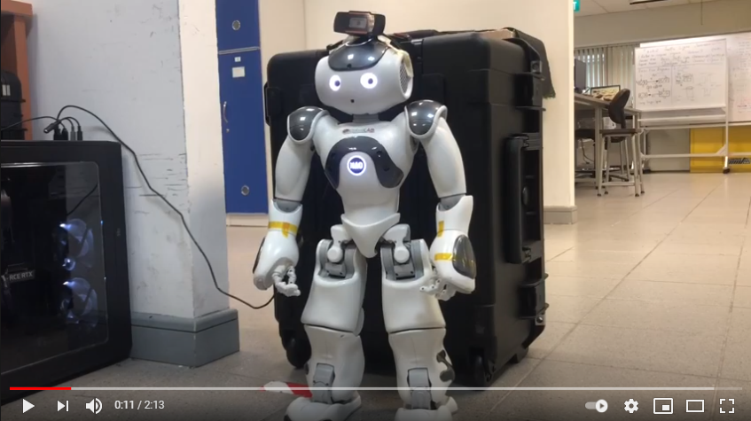

# Chat NAO - A Chatbot web interface to talk for NAO

## Introduction
This chatbot utilizes a blend of AI technologies including IBM's Tone Analyzer, speech recognition, and various other APIs to interact intelligently with users through text and voice. The application is designed to be intuitive and user-friendly, created using the powerful Streamlit library for seamless web deployment.

## Features

- **Tone Analysis**: Leverage IBM's Tone Analyzer to understand and respond to the user's emotional state.
- **Wikipedia Summarizer**: Quickly fetch and summarize articles from Wikipedia on any topic.
- **Real-Time Mask Detection**: Utilize computer vision to detect face masks in real-time, enhancing COVID-19 safety protocols.
- **Speech Recognition**: Converts spoken language into text, making user interaction more dynamic.
- **Interactive Chat**: Engage with NAO using natural language for a wide range of queries and tasks.
- **Humor & Knowledge**: Integrates pyjokes for light-hearted humor and Wolfram Alpha for factual knowledge.

## Technologies

- **Python**: Primary programming language.
- **Streamlit**: For creating the web application.
- **IBM Watson Tone Analyzer V3**: For emotional analysis.
- **Speech Recognition**: Converting spoken words into text.
- **Text2Emotion**: For analyzing text emotions.
- **OpenCV & TensorFlow**: For real-time mask detection.
- **Wikipedia API**: For fetching and summarizing articles.
- **pyjokes**: For generating jokes.
- **Wolfram Alpha**: For factual answers and computations.

## Setup and Installation

1. **Python Installation**: Ensure Python is installed on your system.
2. **Dependency Installation**: Install all the required libraries mentioned in the provided requirements.txt file using the command `pip install -r requirements.txt`.
3. **API Keys**: Obtain necessary API keys for IBM Watson, News API, and Wolfram Alpha, and update them in the respective sections of the script.
4. **Streamlit**: Run the application using the Streamlit command `streamlit run app.py`.

## Usage 

 - Step 1. Get API codes for IBM watson , Wolfralpha and NewsAPI and fill them respectively in chatbot.py
 - Step 2. With the necessary libraries installed , got to anaconda prompt or cmd and type streamlit run chatbot.py
 Chatbot webpage will open automatically !
  
## Demo Video
Click the below image for video

